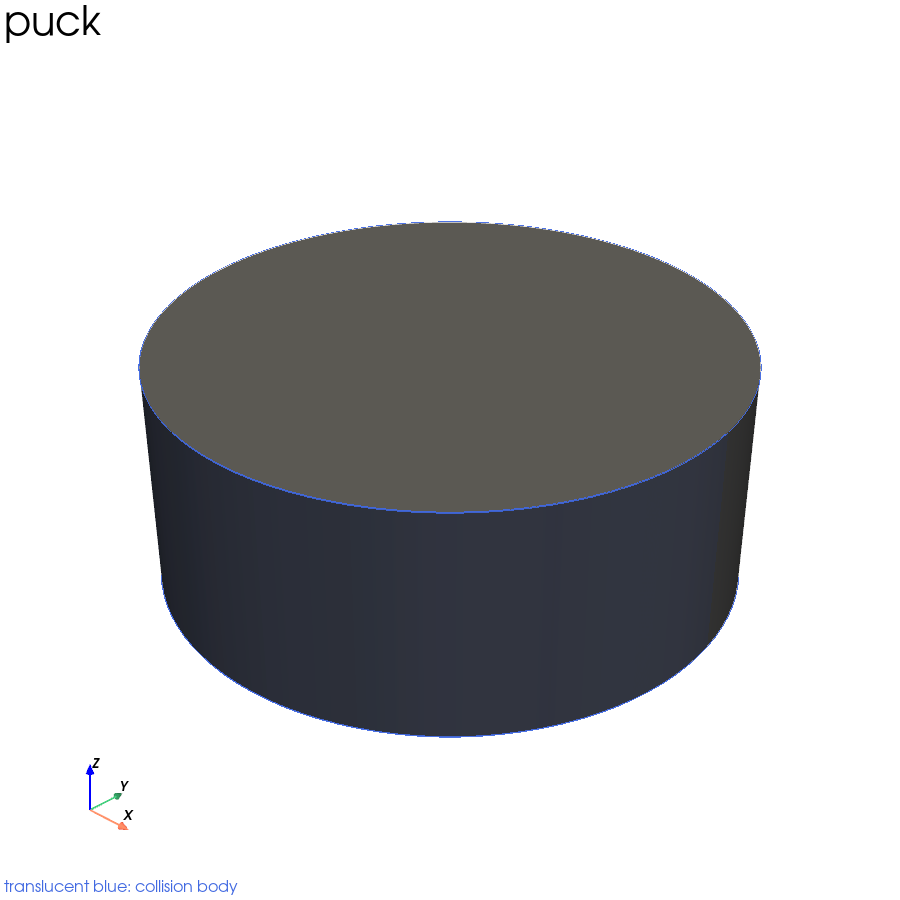
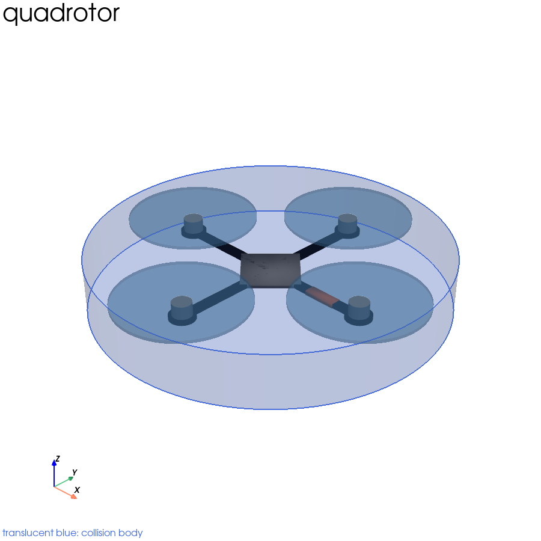
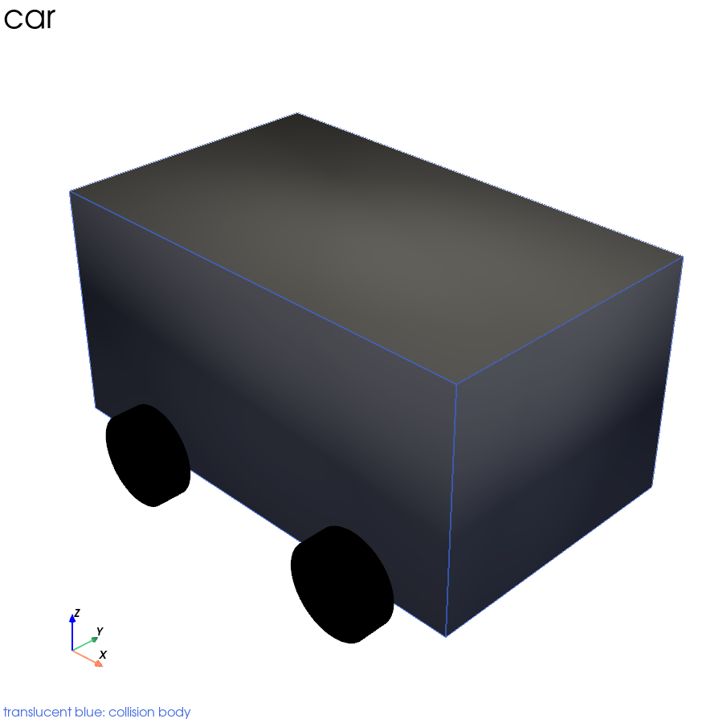

# krrtstar

Hybrid **Python + Rust** kinodynamic RRT\* (kRRT\*) motion planner with
**config-driven dynamics**. System dynamics, robot geometry, obstacle
environments, and experiments are defined by configuration/data files rather
than compiled per model (as in the legacy C++ implementation).

See [`docs/rewrite-plan.md`](docs/rewrite-plan.md) for the design and
[`docs/conversation.md`](docs/conversation.md) for background.

## Features

- **Config-driven linear dynamics** — define `A`, `B`, `c`, control penalty `R`,
  and control bounds in a TOML file. A single general optimal-time connection
  solver (controllability Gramian + arrival-time optimization) replaces the
  legacy per-model closed forms — no MATLAB/Maple.
- **3D geometry & collision** — spheres, oriented boxes, capsules, cylinders, and
  triangle meshes loaded from `.obj` (or any format `trimesh`/`pyvista` can
  read), for both the robot and the obstacles. Shapes can be rotated, and the
  robot's orientation can be driven from the state (Euler indices or a
  quaternion). Collision runs natively via `parry3d` when the Rust core is
  built, with a pure-Python GJK narrow phase as the fallback; both are
  cross-validated to agree exactly.
- **kRRT\* planner** — nearest/near search, best-parent selection, and rewiring
  over the pluggable `Dynamics` interface.
- **Save / load experiments** — persist the tree, config, and metadata as a
  self-describing bundle.
- **Visualization** — 3D rendering of the tree, trajectories, robot, and
  obstacles, with optional live updates during tree growth (headless supported).
  The window opens in the foreground and stays open after planning finishes so
  the result can be inspected; press `q` (or close the window) to exit. Set
  `[visualization] keep_open = false` (or pass `--no-keep-open`) for unattended
  runs.
- **Timing** — planning duration and throughput are reported and stored in the
  saved experiment metadata.
- **Rust hot path (optional)** — a `krrtstar_core` extension runs the whole
  connection in native code: the Euclidean neighbor pre-filter, batched
  connection costs (sharing a precomputed time grid), and full trajectory
  reconstruction, plus `parry3d` collision checking (~15x faster than the Python
  fallback). The package falls back to pure Python when it is not built.
- **Learned dynamics (best-effort)** — an optional PyTorch backend steers via
  gradient/shooting and is treated as best-effort.

## Systems

Every dynamical system from the legacy C++ implementation, defined by config:

| System | State / control | Example |
|---|---|---|
| Single integrator 2D | 2 / 2 | `examples/single_integrator_2d.toml` |
| Double integrator 1D | 2 / 1 | `examples/double_integrator_1d.toml` |
| Double integrator 2D | 4 / 2 | `examples/double_integrator_2d.toml` |
| Double integrator 3D | 6 / 3 | `examples/double_integrator_3d.toml` |
| Quadrotor (linearized) | 10 / 3 | `examples/quadrotor_window.toml`, `examples/quadrotor_two_walls.toml` |
| Nonholonomic car | 5 / 2 | `examples/nonholonomic_car.toml` |

The first five are linear, so they are pure configuration (`kind = "linear"` with
`A`/`B`/`c`/`R`). The car is genuinely nonlinear, so it uses
`kind = "nonholonomic"`: each connection linearizes the system about its start
state and solves that linear problem exactly, which is what the original did.
The returned trajectory therefore satisfies the *linearized* dynamics and only
approximately the true ones — see `krrtstar/dynamics/nonlinear.py`, which can
forward-simulate the real system to measure the deviation and optionally reject
connections that drift too far.

## Robot models

The robot models are ported from `includes/robots.hpp`. As in the original, each
has a coarse **collision** body (what the planner tests) and a detailed
**display** model (what you look at); the images below show the display model
with the collision body overlaid in translucent blue.

Render them yourself with:

```bash
poetry run python -m krrtstar.robot_viz --out /tmp/robot_models
```

| Puck | Quadrotor | Car |
|---|---|---|
|  |  |  |

- **Puck** — a disc (radius 1.25), used by the integrator systems.
- **Quadrotor** — cross beams, four motors and translucent rotors, a hub rotated
  45°, and an orange nose flag; collision body is a disc spanning the rotor tips.
- **Car** — a 5 × 3 × 2.5 box. Note the original placed it offset by half its
  length and width, so heading swings the body *around* the state point rather
  than turning it in place; that is reproduced, and `car_collision(centered=True)`
  opts out.

## Install

```bash
poetry install                 # core (numpy, scipy) + dev (pytest)
poetry install --with viz      # + pyvista for 3D visualization
poetry install --with torch    # + PyTorch for learned dynamics
```

Build the optional Rust accelerator into the Poetry venv:

```bash
poetry run maturin develop --manifest-path rust/Cargo.toml --release
```

## Quick start

```bash
poetry run python -m krrtstar.cli examples/double_integrator_2d.toml --out /tmp/exp
```

Watch the tree grow in 3D and inspect the result when it finishes:

```bash
poetry run python -m krrtstar.cli examples/double_integrator_2d.toml --live
```

which reports, for example:

```
[krrtstar] backend=rust dynamics=linear x_dim=4 target_nodes=300
[krrtstar] nodes=236 found=True cost=15.6876
[krrtstar] planning time: 1.42 s (166.2 nodes/s)
[krrtstar] total time: 1.51 s
```

Or from Python:

```python
from krrtstar.run import run_from_file
result = run_from_file("examples/double_integrator_2d.toml")
print(result.found, result.cost)
```

## Testing

```bash
poetry run pytest
```

## Layout

> Mesh obstacles are treated as **surfaces**, not filled solids: a shape that
> fits entirely inside a closed mesh without touching a triangle is not in
> collision. Prefer primitives for large hollow volumes.

```
krrtstar/        Python package (config, dynamics, geometry, planner, IO, viz)
rust/            Optional Rust acceleration crate (krrtstar_core)
examples/        Example experiment configs
tests/           pytest suite
docs/            Design docs (conversation.md, rewrite-plan.md)
```
